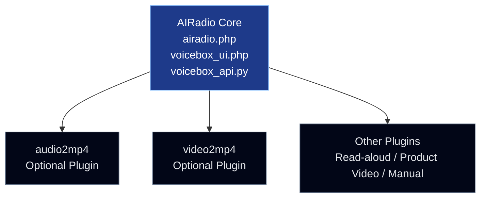

# AIRadio

AIRadio is an automated AI media pipeline that generates  
radio-style audio episodes, background-mixed narration, MP4 videos, and  
podcast-compatible RSS feeds from news articles or keywords.

Users can publish AI-generated radio and podcast content without any manual
recording, editing, or voice work.

---

## What this project does

AIRadio provides a fully automated workflow:

- Ingests news articles or keyword-based content
- Generates radio-style scripts using Large Language Models (LLMs)
- Converts scripts into natural-sounding speech via Text-to-Speech (TTS)
- Optionally mixes background music (BGM)
- Generates podcast-ready RSS feeds
- Optionally converts audio into MP4 video (image + radio)

All steps are automated and self-hosted.

---

## Core Architecture

AIRadio is built around a small but powerful core that acts as a
media-generation engine rather than a single-purpose application.

### Core Components

The core of AIRadio consists of the following components:

- **airadio.php**  
  Handles content flow such as input processing, script generation,
  and orchestration of the overall workflow.

- **voicebox_ui.php**  
  Provides a user interface for controlling TTS parameters such as
  speaker, speed, pitch, and intonation.

- **voicebox_api.py**  
  Exposes unified APIs for controlling LLM-based script generation,
  text-to-speech synthesis, and ffmpeg-based audio/video processing.

Together, these components form the **AIRadio Core Engine**.

### Plugin-Oriented Design

Because the AI and media-processing logic is exposed through simple APIs,
developers can build optional, plugin-style products using plain PHP
without modifying the core engine.

This makes AIRadio highly extensible and suitable for a wide range of
media-generation use cases.

### Optional Plugin Products

AIRadio already demonstrates this extensibility through optional products,
such as:

- **audio2mp4** – Converts audio and scripts into subtitle-based videos  
- **video2mp4** – Reconstructs video content using the same core pipeline

These plugins prove that AIRadio’s core technology can be reused beyond
radio generation.

### Proven Use Cases

The same core architecture can be applied to:

- Radio-style news and podcast generation
- Subtitle-based music videos (MV) for YouTube and TikTok
- Storytelling and read-aloud content
- Product introduction videos
- Product manual and tutorial videos

AIRadio is designed to grow by adding new plugins, showcasing its future
potential through real, working extensions rather than hypothetical ideas.

---

## Outputs (What users get)

- 🎧 Radio-style audio episodes (WAV / MP3)
- 🎵 BGM-mixed narration audio
- 🎬 MP4 video files (image + radio audio)
- 📡 Podcast-compatible RSS feeds
- ⚙️ Fully automated publishing pipeline

These outputs can be directly published to podcast platforms, YouTube,
YouTube Shorts, Spotify Video Podcast, and other media services.

---

## Who this project is for

- Content creators experimenting with automated audio media
- Independent media and podcast projects
- Developers building AI-powered content pipelines
- Educators and researchers exploring spoken summaries
- Self-hosted AI automation enthusiasts

---

## Example outputs

- Sample audio  
  https://exbridge.ddns.net/aidexx/tts/2243b1178ef34e2698a5037bd26ba1d9.wav

- Sample RSS feed  
  https://exbridge.jp/aidexx/rss.xml

---

## How it works

1. Ingests news articles via RSS feeds or keyword-based search
2. Generates radio-style scripts using an LLM
3. Converts scripts into speech using a TTS engine
4. Post-processes audio (BGM mixing, formatting)
5. Outputs audio files and updates podcast-compatible RSS feeds
6. Optionally converts audio into MP4 video

---

## Key features

- Fully automated end-to-end AI pipeline
- News-to-audio and keyword-to-audio conversion
- Optional background music mixing
- Optional audio to MP4 video generation
- Modular architecture
- Self-hosted and customizable
- Open-source (MIT License)

---

## Tech stack

- Large Language Models (LLMs)
- Text-to-Speech (TTS)
- Background music mixing (ffmpeg)
- Podcast-compatible RSS generation
- Python and PHP automation
- FastAPI for media processing APIs

---

## Voicebox (Text-to-Speech Control)

This project includes an optional Voicebox layer for controlling
the Text-to-Speech engine via both UI and API.

- Web-based UI for manual voice testing and tuning
- Python-based API server wrapping the VOICEVOX engine
- Reusable across AI Radio and other automation projects

This separation allows both manual testing via browser
and fully automated TTS generation via scripts.

---

## Repository structure

- src/
  - airadio.php        : Core PHP orchestration logic
  - airadio.py         : Python-based AI script generation
  - ttsfile.php        : TTS integration and audio file handling
  - tts2blog.py        : Audio/text post-processing and publishing utilities
  - rss.php            : Podcast-compatible RSS feed generation
  - bgm_manager.php    : Background music upload, management, and mixing control
  - voicebox_ui.php    : Web UI for manual TTS testing and control
  - voicebox_api.py    : Python API server wrapping the VOICEVOX engine
  - audio2mp4.php      : Web UI for image + audio to MP4 generation
- bgm/        : User-managed background music files
- mixed/      : Auto-generated mixed audio output
- video_mp4/  : Auto-generated MP4 video output
- README.md
- LICENSE
- .gitignore

---

## Architecture Overview

## Background Music (BGM) Support

AIRadio supports optional background music (BGM)
as part of its audio post-processing pipeline.

Generated radio narration can be mixed with background music
before publishing.

---

## BGM Program Overview

Background music handling is implemented as a first-class feature.

- bgm_manager.php  
  Uploads, manages, and configures background music files.

- ttsfile.php  
  Manages generated TTS audio files.

- tts2blog.py  
  Performs post-processing and mixes narration audio with BGM using ffmpeg.

---

## BGM Files

Directory: bgm/

- Stores user-provided background music files
- Managed via bgm_manager.php
- Not auto-generated

Supported formats:

- mp3
- wav
- m4a

---

## Mixed Audio Output

Directory: mixed/

- Stores final mixed audio files
- Includes narration and BGM
- Automatically generated
- Ready for playback or publishing

---

## Audio to MP4 Video Generation

AIRadio includes an optional feature to convert
generated radio audio into MP4 video files by combining
the audio with a single static image.

---

## Video Generation Architecture

- PHP server  
  Provides Web UI for image upload and audio URL input.  
  Does not execute ffmpeg.

- Python API server (FastAPI)  
  Executes ffmpeg, generates MP4 files,
  and returns public URLs for generated videos.

---

## Web Usage (MP4 Generation)

1. Open audio2mp4.php
2. Upload an image file (PNG / JPG)
3. Enter a generated audio file URL (mp3 / wav)
4. Click Generate MP4
5. The generated video is immediately playable and downloadable

---

## API: Audio to MP4

Endpoint: POST /audio_to_mp4

Request parameters:

- image : static image file (PNG / JPG)
- audio_url : URL of the audio file (mp3 / wav)

Response example:

- ok: true
- file: xxxxxxxx.mp4
- mp4_url: https://exbridge.ddns.net/aidexx/video_mp4/xxxxxxxx.mp4

---

## Extensibility

The project is designed with a modular architecture, making it easy to:

- Swap LLMs
- Change TTS engines
- Customize BGM logic
- Add new publishing targets
- Integrate new automation workflows

---

## License

MIT License
